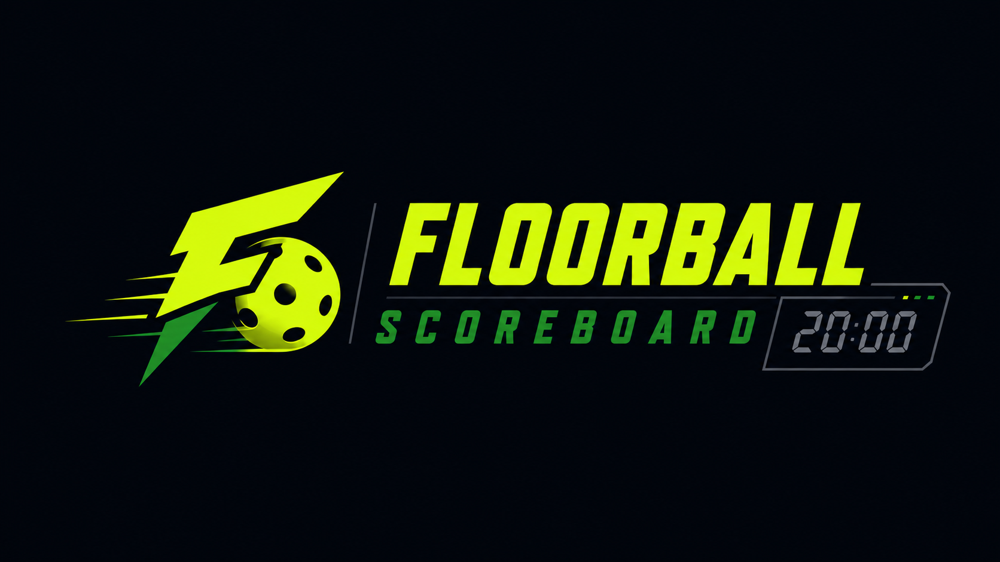
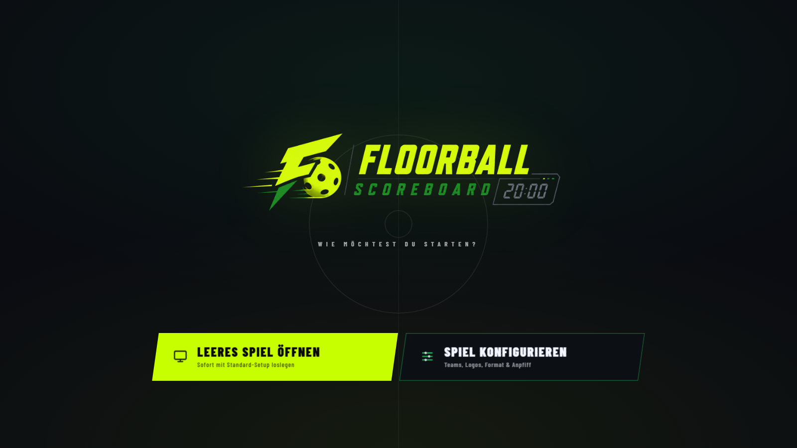
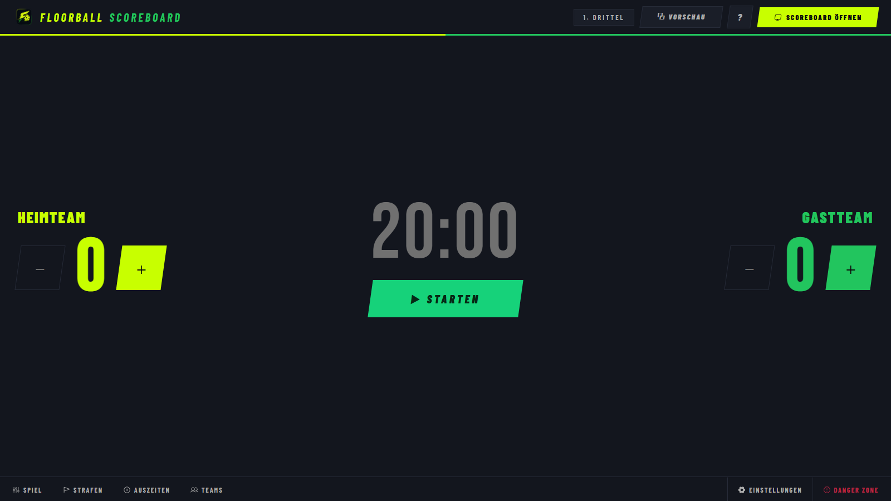
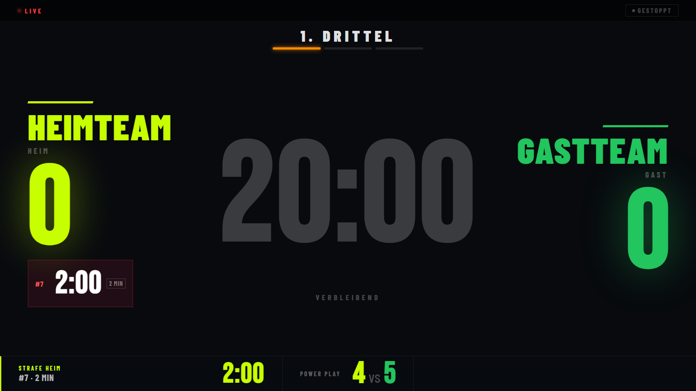
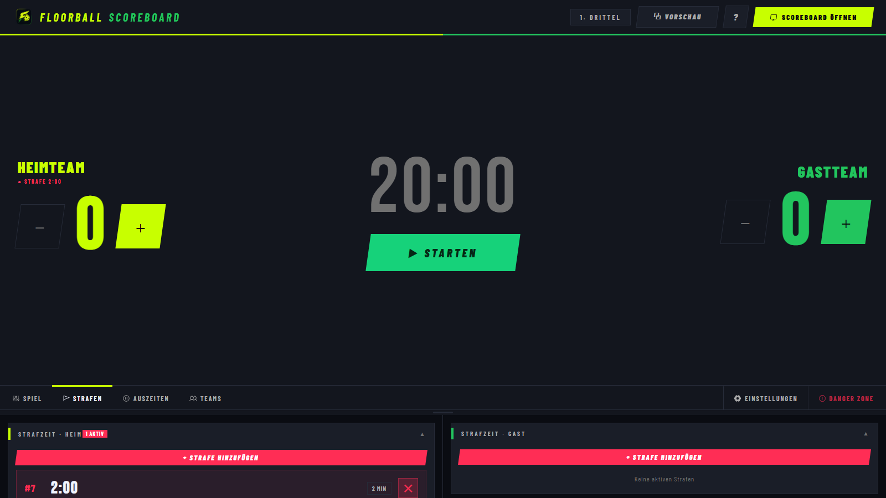
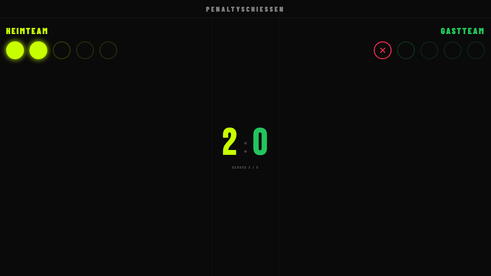
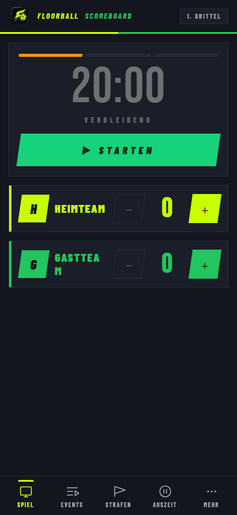

# Floorball Scoreboard App

Eine Scoreboard-App für Floorball – verfügbar als HTML-Datei (z.B. via GitHub Pages) und als installierbare Desktop-App (Electron).


---

## Screenshots

<table>
<tr>
<td width="33%"><br><sub>Startscreen</sub></td>
<td width="33%"><br><sub>Controller</sub></td>
<td width="33%"><br><sub>Scoreboard-Präsentation</sub></td>
</tr>
<tr>
<td><br><sub>Strafen-Tab</sub></td>
<td><br><sub>Penaltyschießen</sub></td>
<td><br><sub>Mobile-Ansicht</sub></td>
</tr>
</table>

Screenshots aktualisieren: `npm run screenshots` ([scripts/screenshots.js](scripts/screenshots.js), Playwright – einmalig vorher `npx playwright install chromium`).

---

## Features

**Spielsteuerung**
- Effektive Spielzeitmessung (Großfeld 3 × 20 Min, Großfeld Spieltagsmodus 3 × 15 Min, Kleinfeld 2 × 20 Min)
- Start/Stop per Button oder **Leertaste**
- Tore mit +/− Buttons pro Team, Tortypen Normal / Penalty / Eigentor / Technisches Tor
- Automatischer Buzzer-Sound bei Ablauf der Spielzeit
- Pausentimer (10 / 7 / 5 Min je nach Format)
- Undo-Stack für die letzten Aktionen (**Strg+Z**)

**Strafzeiten & Auszeiten**
- Bankstrafe (2 Min), Große Bankstrafe (2+2 Min), Persönliche 10-Min-Strafe + weitere Strafarten nach SPRGK 2026
- Strafzeiten laufen synchron mit der Spieluhr, Strafenlimit pro Team (Großfeld 2, Kleinfeld 1 gleichzeitig laufend)
- Gepaarte Strafen (§603.9): Erkennung passender Gegner-Strafen mit Kopplungs-Dialog
- 1 Auszeit pro Team (30 Sek), unabhängig von der Spieluhr
- Laufende Strafen sichtbar in Steuerung und Präsentation

**Penaltyschießen**
- Eigene Shootout-Ansicht auf dem Scoreboard mit Punkte-Visualisierung
- Automatische Zusatzrunden und Sieger-Ermittlung nach SPRGK §204

**Teamkonfiguration**
- Teamname, Logo (Upload), Akzentfarbe und Trikotfarbe pro Team
- Alle Farben wirken live auf Scoreboard und Vorschau, automatische Farbvorschläge aus dem Logo
- Spieltag-Vorlagen: Spiel-Konfigurationen speichern und über das Electron-Menü wieder laden (nur Desktop-App)

**Präsentation**
- Separates Scoreboard-Fenster als Hallenanzeige für zweiten Monitor / Beamer
- Mobile Controller-Ansicht (Bottom-Nav) für Steuerung vom Smartphone/Tablet
- Hell- und Dunkelmodus, einstellbare Schriftgröße der Steuerungs-Tabs
- Uhrrichtung (hoch/runter) für Steuerung und Präsentation unabhängig einstellbar
- Eingebettete Vorschau (PiP) direkt in der Steuerungsansicht
- Tor-Animation, Auszeit-Overlay, Pausen-Overlay

**Spielbericht**
- Chronologische Timeline aller Spielereignisse (Tore, Strafen, Auszeiten)
- Export als Druck/PDF, Markdown (Zwischenablage) oder JSON (Datei)

**Musiksteuerung** *(Proof of Concept, nur Desktop-App)*
- Playlist-Ordner und Tor-Hymnen manuell über einen eigenen Tab steuern
- Optionale, experimentelle Spotify-Fernsteuerung als alternative Wiedergabequelle

---

## Benutzung

### Option A – Browser / GitHub Pages (kein Install)

1. Repository herunterladen oder klonen
2. `scoreboard.html` im Browser öffnen – das ist die **Steuerungsansicht**
3. Auf **📺 Scoreboard öffnen** klicken – öffnet das Scoreboard in einem neuen Fenster
4. Scoreboard-Fenster auf den zweiten Monitor / Beamer ziehen und maximieren

Kein Server, kein Build-Schritt, keine Abhängigkeiten. Die Dateien funktionieren direkt von der Festplatte (`file://`) oder über [GitHub Pages](https://sakritz.github.io/Floorball-Scoreboard/scoreboard.html).

> **Hinweis:** Steuerung und Scoreboard müssen im selben Browser geöffnet sein, da die Synchronisation über die `BroadcastChannel`-API läuft.

### Option B – Electron Desktop-App

Die Electron-App schaltet zusätzliche Features frei: Scoreboard-Fenster auf einem zweiten Monitor, OBS-Overlay für Streams, Spieltag-Vorlagen über das Anwendungsmenü sowie die (experimentelle) Musik-/Spotify-Steuerung.

**Als Endnutzer** einfach den passenden Installer herunterladen und ausführen – keine weiteren Voraussetzungen.
 
**Für Entwickler** (selbst bauen / starten, im Repo-Root):

```bash
npm install
npm start
```

| Shortcut | Aktion |
|---|---|
| `F12` | Scoreboard-Fenster auf zweitem Monitor öffnen / schließen |
| `F11` | Controller-Fenster Fullscreen umschalten |
| `Escape` | Fullscreen beenden |

Shortcuts gelten nur bei fokussierter App (keine globalen System-Shortcuts). Über das Anwendungsmenü (Datei / Ansicht / Hilfe) lassen sich außerdem Spieltag-Vorlagen laden/verwalten und die OBS-Adresse kopieren.

**OBS-Overlay:** Wenn die Electron-App läuft, ist das Overlay unter `http://localhost:8080/stream.html` erreichbar. In OBS als Browser-Quelle hinzufügen.

---

## Dateistruktur

```
scoreboard.html       Markup-Gerüst (Startscreen, Steuerung + Scoreboard)
stream.html           OBS-Overlay (Score-Leiste für Streams)
presets-manager.html  Fenster zum Verwalten gespeicherter Spieltag-Vorlagen (Electron)
logo.png

css/
  base.css            CSS-Variablen & Reset
  scoreboard.css      TV-/Monitor-Ansicht
  controller.css      Steuer-Panel
  ui.css              Dialoge & Overlays
  mobile.css          Mobile Controller-Ansicht (Bottom-Nav)

js/
  state.js            Zentrales State-Objekt
  undo.js             Undo-Stack
  persistence.js      localStorage
  controller.js       Spieluhr & Score-Steuerung
  palette.js          Farbpalette & Periodensteuerung
  game-flow.js        Spielfluss (Strafen, Perioden, Auszeiten)
  logo.js             Logo-Farbextraktion
  buzzer.js           Buzzer-Sounds
  music.js            Musiksteuerung (Proof of Concept, nur Electron)
  render.js           Scoreboard-Rendering
  report.js           Spielbericht-Export (PDF/Markdown/JSON)
  ui.js               Dialoge, Startscreen, Setup
  mobile.js           Mobile Navigation (Bottom-Nav, „Mehr"-Menü)

electron/
  main.js             Electron-Hauptprozess (Fenster, Express-Server, Menü)
  preload.js          IPC-Bridge (u.a. Spieltag-Vorlagen)
  spotify.js          Spotify-Fernsteuerung (Proof of Concept)
  assets/icon.png

package.json          Root: electron, express, electron-builder (Build-Config)
scripts/
  screenshots.js      Screenshots für README aktualisieren (Playwright, devDependency)
img/screenshots/      Generierte Screenshots (siehe oben)
docs/                 ARCHITECTURE.md, Anleitung, ROADMAP.md
documents/            Regelwerke (SPRGK 2022/2026, Synopse), Spielberichtsbogen
legacy/               Alte Single-File-Version (nicht mehr gepflegt)
```

---

## Technischer Hintergrund

Die App besteht aus einer schlanken `scoreboard.html` (~1400 Zeilen reines Markup) mit ausgelagertem CSS (`css/`) und JavaScript (`js/`). Kein Framework, kein Build-Schritt – Vanilla HTML, CSS und JS.

**Synchronisation** zwischen Steuerung und Scoreboard läuft über [`BroadcastChannel`](https://developer.mozilla.org/en-US/docs/Web/API/BroadcastChannel) – kein WebSocket, kein Server nötig. Im Browser-Modus teilen beide Fenster denselben Ursprung, wodurch die API zuverlässig funktioniert.

**OBS-Overlay** (nur Electron): Die Electron-App startet einen lokalen Express-Server auf Port 8080. Der Controller schickt bei jeder Änderung den State per HTTP POST an `/api/state`; `stream.html` pollt diesen Endpoint alle 200 ms. BroadcastChannel funktioniert zwischen Electron und OBS nicht (separate Chromium-Prozesse), daher der HTTP-Polling-Ansatz.

**Buzzer-Sound** wird über die [Web Audio API](https://developer.mozilla.org/en-US/docs/Web/API/Web_Audio_API) synthetisiert – kein externes Audio-File.

**Spielbericht** wird clientseitig aus dem Ereignisprotokoll (`S.events`) erzeugt – PDF läuft über den Browser-Druckdialog, Markdown geht in die Zwischenablage, JSON wird als Datei heruntergeladen.

**Musiksteuerung** (nur Electron, Proof of Concept) spielt lokale Dateien aus einem gewählten Playlist-Ordner ab; die optionale Spotify-Fernsteuerung läuft über einen lokalen, einmalig zu autorisierenden OAuth-Flow (`electron/spotify.js`).

**Schriften** werden von Google Fonts geladen (Barlow Condensed, Bebas Neue). Bei fehlendem Internetzugang fallen die Texte auf Systemschriften zurück.

Eine ausführliche Beschreibung der internen Architektur (Datenfluß, State-Objekt, Undo-System) findet sich in [ARCHITECTURE.md](docs/ARCHITECTURE.md).

Ideen für mögliche nächste Schritte (unverbindlich) gibt es in der [ROADMAP.md](docs/ROADMAP.md), Änderungen pro Version im [CHANGELOG.md](CHANGELOG.md).

---

## Regelwerk

Die Spielzeiten, Strafzeiten und Auszeiten entsprechen den **Floorball Spielregeln Großfeld/Kleinfeld (SPRGK) 2026** von Floorball Deutschland (gültig ab 1.7.2026). Die Regeldokumente (2022, 2026 und eine Synopse der Änderungen) liegen unter [`documents/`](documents/).

| Format | Spielzeit | Pause | Auszeit |
|---|---|---|---|
| Großfeld | 3 × 20 Min | 10 Min | 1 × 30 Sek |
| Großfeld Spieltag | 3 × 15 Min | 7 Min | 1 × 30 Sek |
| Kleinfeld | 2 × 20 Min | 5 Min | 1 × 30 Sek |

---

## Lizenz

MIT – frei nutzbar, veränderbar und weitergeben.

The electron releases of this project bundle Node.js/Electron and third-party npm packages under their respective licenses – see `electron/THIRD-PARTY-LICENSES.md`.
